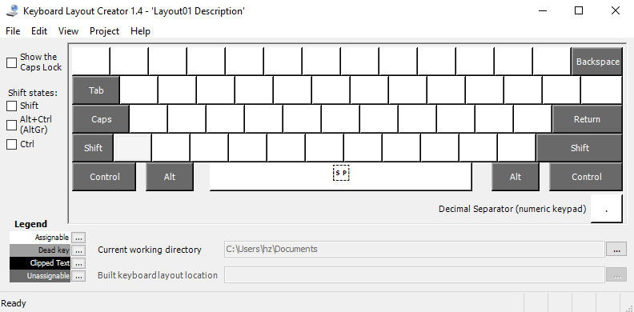
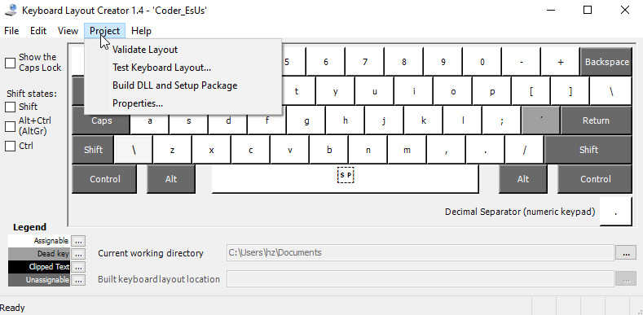
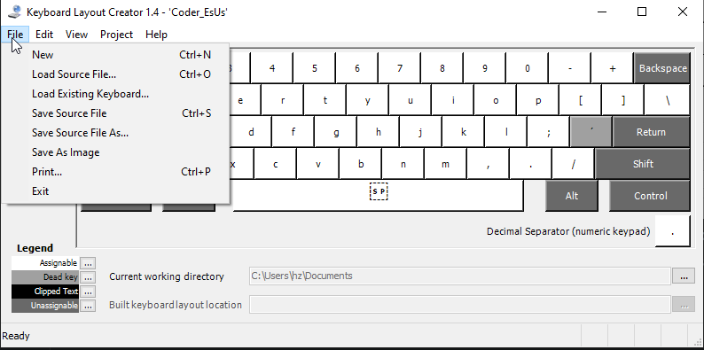
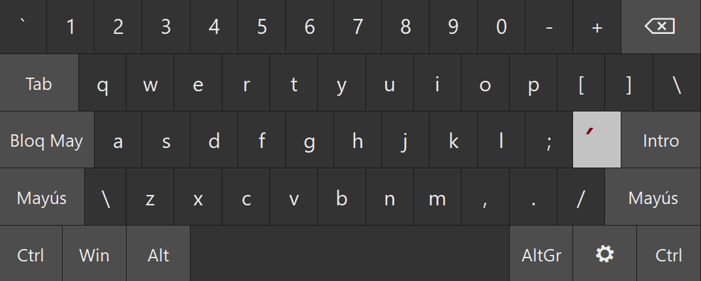
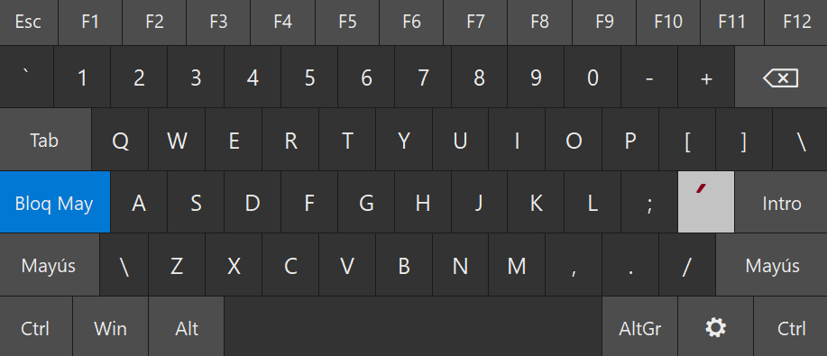
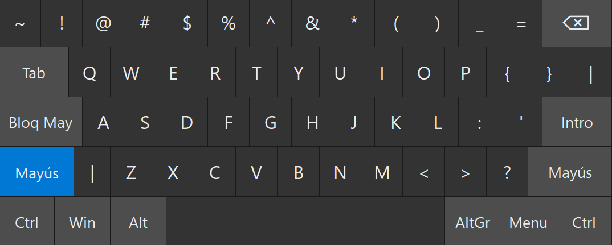
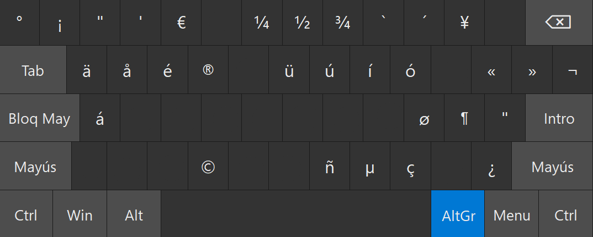
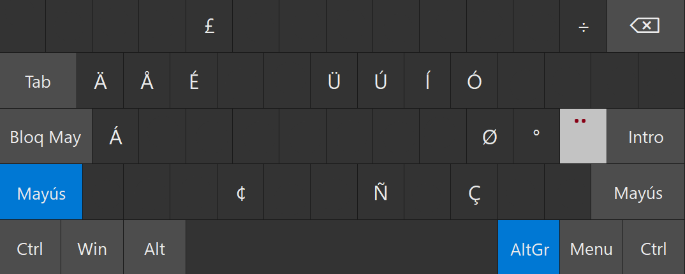

# Coder EsUs

## Descripción

autor: lib.bioq@gmail.com
versión: 1.0.0

Descripción: Permite a un programador escribir en español utilizando la distribución **QWERTY** **Inglés (United States)** el cual es posible gracias a la reasignación estratégica de las teclas.

La distribución de teclas **QWERTY** **Inglés (United States)** esta mejor distribuida para acceder a todos los caracteres que un programador necesita pero, hace difícil utilizar el teclado para escribir caracteres acentuados (*á é í ó ú ñ ü*). Para solucionar el problema se utilizado el programa de **microsoft** [Microsoft Keyboard Layout Creator (MSKLC) Version 1.4](https://www.microsoft.com/en-us/download/details.aspx?id=102134).

## Acerca de **Microsoft Keyboard Layout Creator (MSKLC)**

**Show the Caps Lock**: Muestra los caracteres activos cuando la tecla de mayúsculas(**caps**) esta activa.

**Shift**: Muestra los caracteres activos cuando la tecla **shift** esta presionada.

**Alt+Ctrl(AltGr)**: Muestra los caracteres activos cuando la tecla **altGr** esta presionada.

`legend`:

**Assignable**: (Fondo Blanco) representa a las teclas que pueden ser re-mapeadas.

**Dead key**: (Fondo gris claro) representa a las teclas que al ser presionadas esperan que una segunda tecla sea presionada para generar un nuevo carácter. Ejemplo: el carácter acento(`´`) el **Dead key**: `<kbd>`´`</kbd>`+`<kbd>`a`</kbd>` = `<kbd>`á`</kbd>`, `<kbd>`´`</kbd>`+`<kbd>`e`</kbd>` = `<kbd>`é`</kbd>`.

**unassignable**: Teclas que no pueden ser reasignadas.

**current working directory**: directorio en el que almacenará el teclado reasignado.

### opciones de desarrollador

**validate layout**: Verifica que nuestra asignación de teclas es correcta y no tenga conflictos.

**Test keyboar Layout...**: Despliega un editor de texto en el cual podemos probar las reasignaciones hechas.

**Build DLL and Setup Package**: Construye el ejecutable de nuestro teclado.

**Properties**: Permite cambiar las propiedades de nuestro teclado.

**New**: Crea un proyecto nuevo desde cero.

**Load source file**: Carga la distribución desde un archivo con la extensión **klc**.

**Save source file**: Guarda el proyecto actual en archivo de texto con la extensión **klc**.

**Save source file as**: Guarda un proyecto existente con un nuevo nombre.

## Coder EsUs Remap Description

**posición normal**

**Tecla de mayúsculas presionada**

**Tecla shift presionada**

**Tecla AltGr presionada**

**Tecla Shift + AltGr presionadas**

### Dead keys

#### Dead Keys acento (`´`)

| Con | Resultado |
| ---- | ---- |
| a | á |
| e | é |
| u | ú |
| i | í |
| y | ý |
| o | ó |
| A | Á |
| E | É |
| U | Ú |
| I | Í |
| Y | Ý |
| O | Ó |
| n | ñ |
| N | Ñ |
|   | ´ |

#### Dead keys diéresis (`¨`)
| Con | Resultado |
| ---- | ---- |
| u | ü |
| U | Ü |

